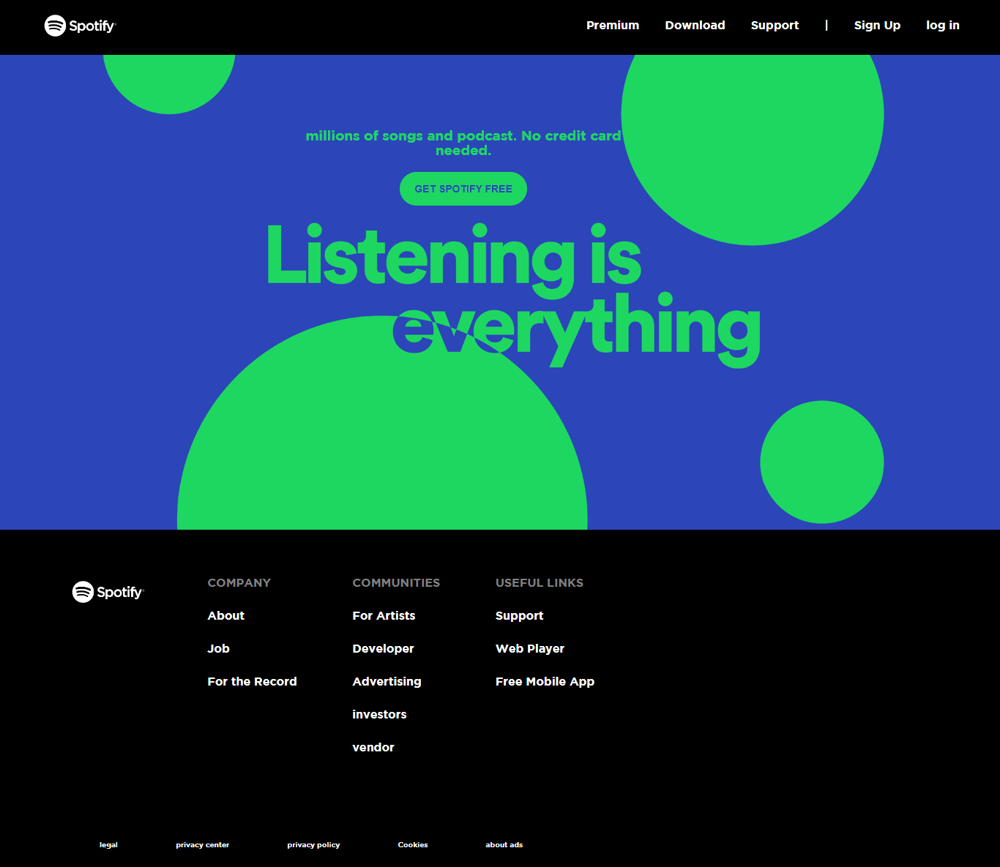

# A Clone Of Spotify's Website- Landing page & Premium Page Respectively

This is my attempt at reproducing a few web pages of spotify's website. 

## Table of contents

- [Overview](#overview)
  - [Screenshot](#screenshot)
  - [Links](#links)
- [My process](#my-process)
  - [Built with](#built-with)
  - [What I learned](#what-i-learned)
  - [Continued development](#continued-development)
  - [Useful resources](#useful-resources)
- [Author](#author)
- [Acknowledgments](#acknowledgments)

## Overview

The task was to reproduce the landing pages and the premuium pages to be as close to the original as possible, using just HTML and CSS alone. This document provides a detailed explanation of methodology and technologies used at different points; from inception to finalization of this project in order to achieve this end-result.

### Screenshots

### Links

-None

## My process

I began by using HTML to build the foundation of the website before progressively incorporating CSS to provide styling to the web pages.Prior to developing the middle section area and designing the buttons for it, I first created the header and navbar and added the connections to them.The links were then placed down the footer using the CSS flexbox property, which I then used to create the footer area.The social media links were then positioned in the footer using Flexbox as well.The second page's first portion was created using HTML, and the buttons in this section were animated using CSS animation attributes.
I then went on to make the page's second portion. Here, i created the second half of the page, which included the subscription cards for the various products, I designed these cards using CSS Flexbox. I then reused the earlier code for the footer here and made a repository on Github for this project.   

### Built with

- HTML
- CSS

### What I learned

- How to postion Background images.
- How to use CSS Transition Properties.
- How tto use Flexbox to position Navbar Items.
- How to use the align Items properties, while using flexbox.

### Continued development
 I want to get better at building Websites in the future.

## Author
- Twitter - [BIG_BENNEY](https://www.twitter.com/BIG_BENNEY)

## Acknowledgments

I want to thank myself for sticking through this and finally finishing it. It is a testement of my will and determination to become a software developer. Thank you for taking these small baby steps.
