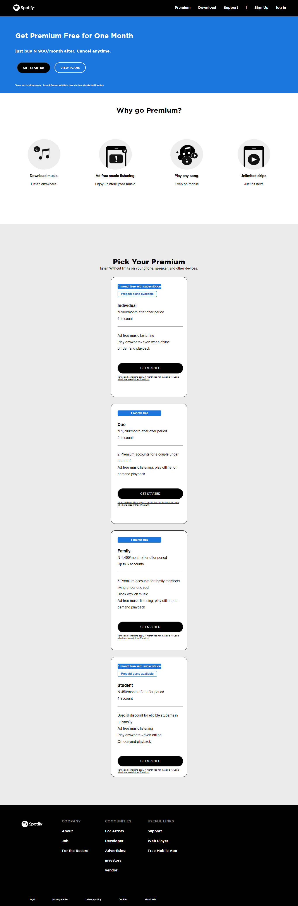

# A Clone Of Spotify's Website- Landing page & Premium Page Respectively

This is my attempt at reproducing a few web pages from Spotify's website. 

## Table of contents

- [Overview](#overview)
  - [Screenshot](#screenshot)
  - [Links](#links)
- [My process](#my-process)
  - [Built with](#built-with)
  - [What I learned](#what-i-learned)
  - [Continued development](#continued-development)
  - [Useful resources](#useful-resources)
- [Author](#author)
- [Acknowledgments](#acknowledgments)

## Overview

The task was to reproduce the landing pages and the premium pages to be as close to the original as possible, using just HTML and CSS alone. This document provides a detailed explanation of the methodology and technologies used at different points; from inception to finalization of this project in order to achieve this end result.

### Screenshots

### Links

-None

## 
I started by laying the foundation of the website using HTML, and as I progressed, I incorporated CSS to style the web pages. Initially, I focused on creating the header and navbar and establishing their connections. Subsequently, I designed the buttons and the middle section area. For the footer, I utilized the CSS Flexbox property to arrange the links and later positioned the social media links using Flexbox as well.

Moving on to the second page, I began by crafting its first portion using HTML. The buttons in this section were brought to life through CSS animation attributes. Afterward, I proceeded to work on the second half of the page, which included designing subscription cards for different products. To achieve this, I employed CSS Flexbox once again. To maintain consistency, I reused the footer code from the previous page.

Lastly, I took the project to Github, creating a repository for easier management and collaboration.   

### Built with

- HTML
- CSS

### What I learned

- How to position Background images.
- How to use CSS Transition Properties.
- How to use Flexbox to position Navbar Items.
- How to use the align Items properties, while using flexbox.

### Continued development
 I want to get better at building Websites in the future.

## Author
- Twitter - [BIG_BENNEY](https://www.twitter.com/BIG_BENNEY)

## Acknowledgments

I want to thank myself for sticking through this and finally finishing it. It is a testament to my will and determination to become a software developer. Thank you for taking these small baby steps.
